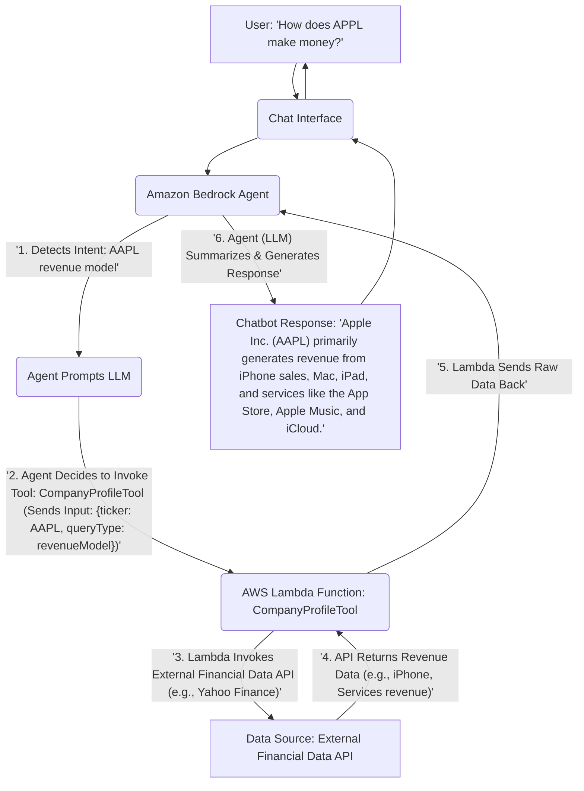
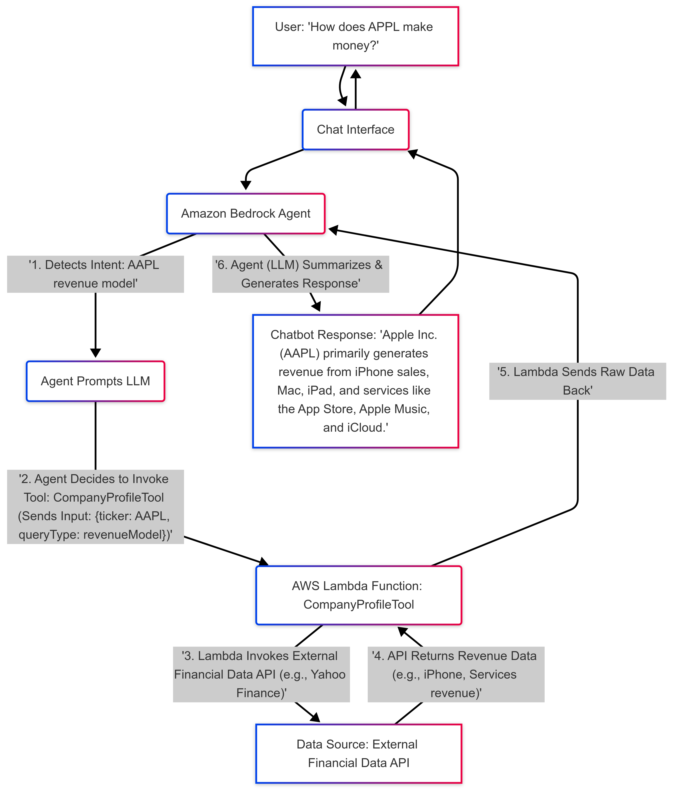

### 1. Workflow Diagram: AWS Bedrock Agent (with example query)

**Example Query:** "How does APPL make money?"

**Additional Explanation:**
* The **Agent (LLM)** will be intelligent enough to interpret "make money" as a request for the revenue model or business segments, and select the appropriate `CompanyProfileTool`.
* The `CompanyProfileTool` should be designed to fetch "revenue model" or "earnings segments" type of data.
