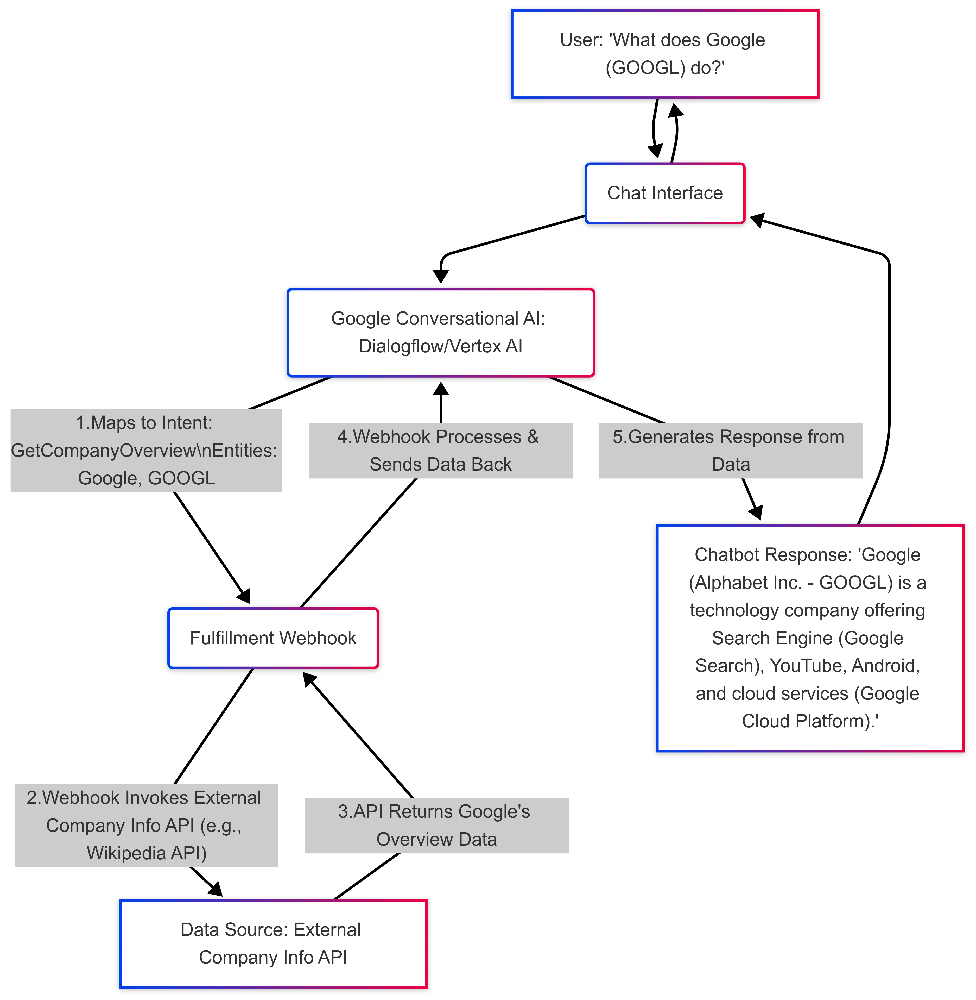

### 2. Workflow Diagram: Google Conversational AI (Dialogflow/Vertex AI Conversation) (with example query)

**Example Query:** "What does Google (GOOGL) do?"

```mermaid
graph TD
    A["User: \"What does Google (GOOGL) do?\""] --> B(Chat Interface)
    B --> C(Google Conversational AI: Dialogflow/Vertex AI)
    C -- 1. Maps to Intent: GetCompanyOverview<br>Entities: {company: "Google", ticker: "GOOGL"} --> D(Fulfillment Webhook)
    D -- 2. Webhook Invokes External Company Info API (e.g., Wikipedia API) --> E[Data Source: External Company Info API]
    E -- 3. API Returns Google's Overview Data --> D
    D -- 4. Webhook Processes & Sends Data Back --> C
    C -- 5. Generates Response from Data --> F["Chatbot Response: \"Google (Alphabet Inc. - GOOGL) is a technology company offering Search Engine (Google Search), YouTube, Android, and cloud services (Google Cloud Platform).\""]
    F --> B
    B --> A
```


**Additional Explanation:**
* **Dialogflow/Vertex AI** will have a pre-trained Intent called `GetCompanyOverview` that recognizes this type of question and extracts the company name/ticker as an Entity.
* The **Webhook** will receive the `Google` and `GOOGL` Entities to use when calling the API.