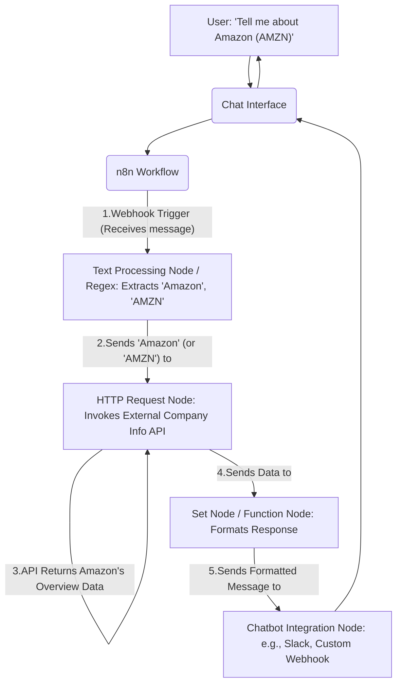

### 3. Workflow Diagram: n8n (No-code option) (with example query)

**Example Query:** "Tell me about Amazon (AMZN)."

**Additional Explanation:**
* A **Text Processing Node** in n8n (possibly using Regular Expressions or simple logic) would extract the company name/ticker from the user's message.
* The **HTTP Request Node** would be configured to call an API that provides company overview information.
* A **Set Node / Function Node** would then take the API's response and format it into a human-readable answer.
